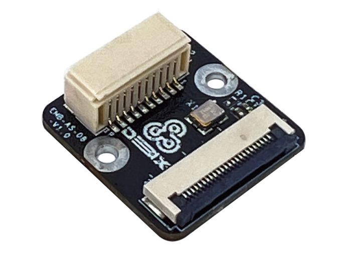
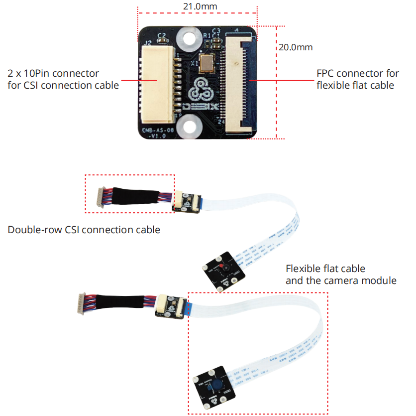
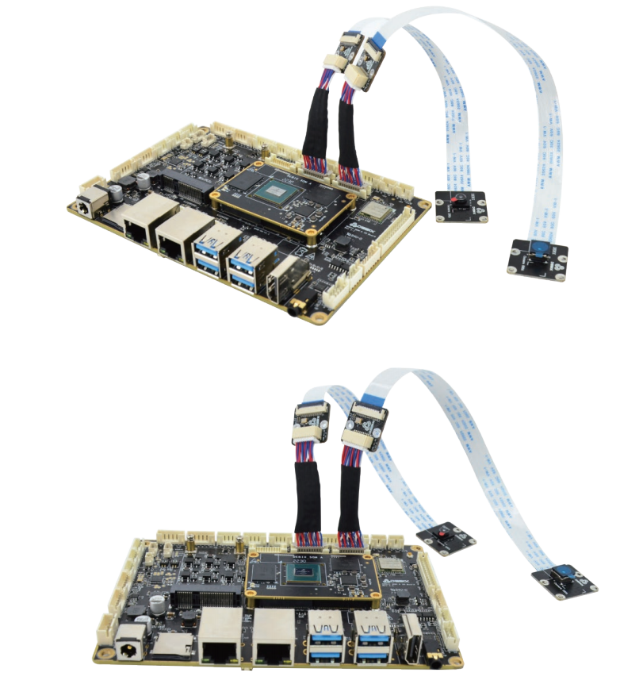

# Camera Adapter Board
 

## Overview
Camera Adapter Board is an add-on board designed for DEBIX SOM A I/O Board to allow the connection with the DEBIX Camera Module. It has a FPC connector for the flexible flat cable of the camera module and a 2 x 10Pin connector for the CSI connection cable.

## Main Features:
- Includes the double-row CSI connection cable
- Designed for DEBIX SOM A I/O Board
- Compatible with Camera 200A, Camera 500A and Camera 1300A

## Specification
| Interfaces      |                              |
|-----------------|------------------------------|
| Double-row Connector | 1 x double-row connector for the CSI cable of the DEBIX SOM A I/O Board |
| FPC connector   | 1 x FPC connector for the FPC cable of the DEBIX camera module |
| **Mechanical**  |
| Dimension       | 21.0mm(L) x 20.0mm(W) (±0.5mm) |

## Connection Diagram:

## Safety Instructions and Warnings:
**General:**
- Avoid exposure to water, moisture and conductive surfaces while operating.
- Handle with care to avoid mechanical or electrical damage to the circuit board and connectors.
- Only handle the board by the edges when powered on to minimize the risk of electrostatic discharge damage.

**Environment:**
- Operate in a well-ventilated environment, even if using a case.
- Place on a stable, flat, non-conductive surface and avoid contact with conductive items.

**Connections:**
- Use peripherals that comply with relevant standards for the country of use and ensure proper insulation and operation.

**Additional notes:**
- This summary is not exhaustive, please refer to the full User Manual for details.
- If you are unsure about any aspect of safety or operation, consult a qualified
professional.

## Contact Us
- **Headquarters**: DEBIX Technology Inc., 8345 Gold River Ct., Las Vegas, NV 89113, USA  
- **Factory**: 5-6/F., East Zone, Shunheda A2 Building, Liqxiandong Industrial Park, XiLi, Nanshan Dist., Shenzhen, China  
- **Email**: info@debix.io  
- **Website**: [www.debix.io](https://www.debix.io)  
- **Community**: [Discord](https://discord.com/invite/adaHHaDkH2)